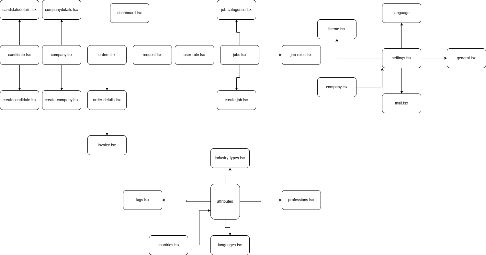

# RMS - Frontend

## Getting Started

### Prerequisites

- [Node.js](https://nodejs.org/en/) (version 12.0.0 or higher)
- [Yarn](https://yarnpkg.com/) (version 1.0.0 or higher)

### Installation

1. Clone the repository:

```bash
git clone https://github.com/your-username/rms-frontend.git
```

2. Navigate to the project directory:

```bash
cd rms-frontend
```

3. Install the dependencies:

```bash
yarn install
```

### Running the Application

1. Start the development server:

```bash
yarn start
```

2. Open your browser and navigate to `http://localhost:3000` to view the application.

### Building the Application

To build the application for production, run:

```bash
yarn build
```

This will create a `build` directory containing the optimized production build of the application.

### Deployment

You can deploy the built application to any static file hosting service, such as Netlify, Vercel, or GitHub Pages.

## Contributing

Contributions are welcome! Please read the [CONTRIBUTING.md](CONTRIBUTING.md) file for guidelines on how to contribute to this project.

## License

This project is licensed under the MIT License - see the [LICENSE](LICENSE) file for details.


### Routing

The application uses React Router for client-side routing. The `App.tsx` file sets up the main routing configuration, and the `pages` directory contains the individual route components.



## Libraries and Dependencies

The application uses several libraries and dependencies to build and run. Here is a list of the main libraries and their versions:

- React19 + Vite
- React Router7
- Material UI6
- Tailwind CSS4
- Lucide React0.483.0
- React Icons5.5.0
- React Switch7.1.0
- Clsx2.1.1


